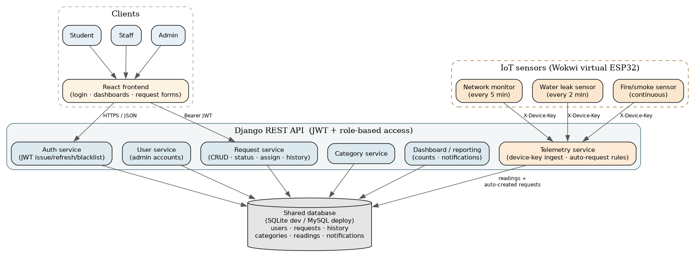
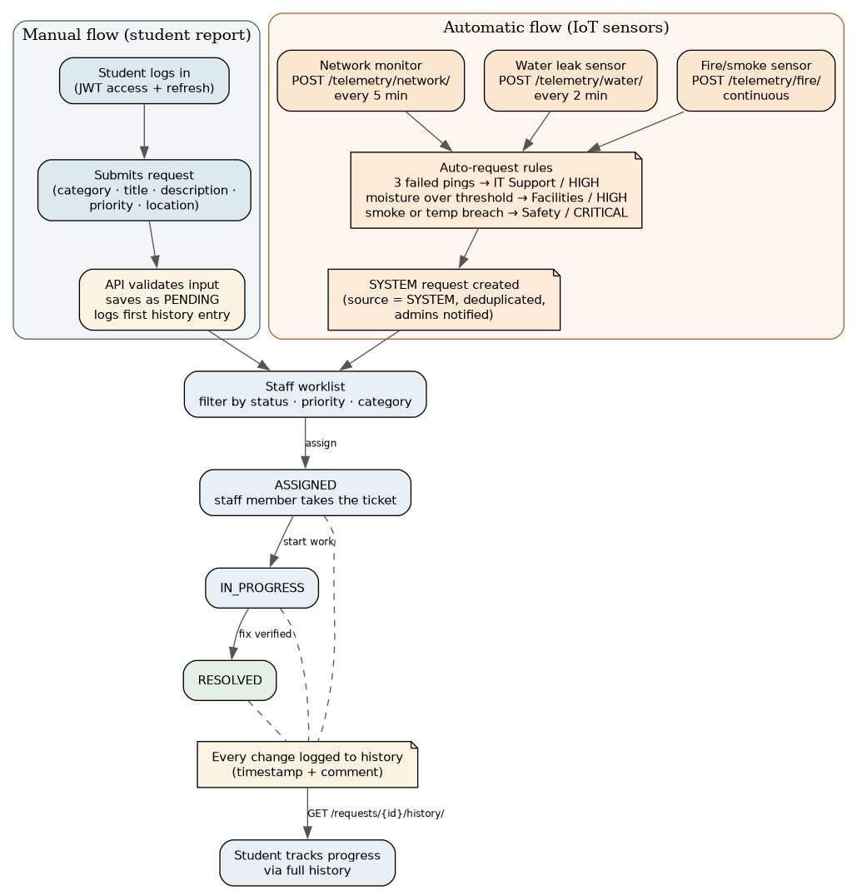
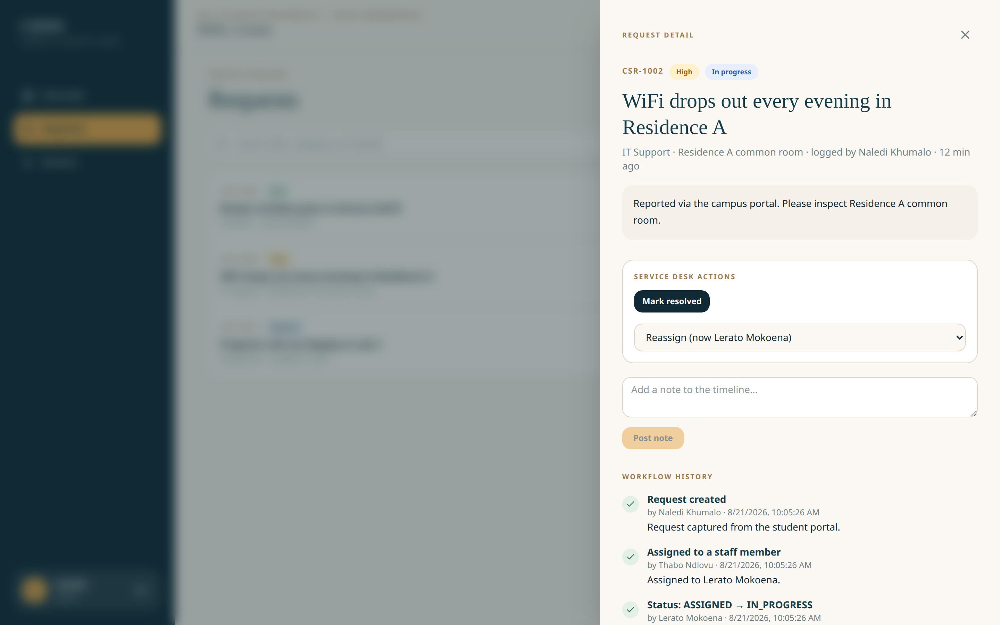
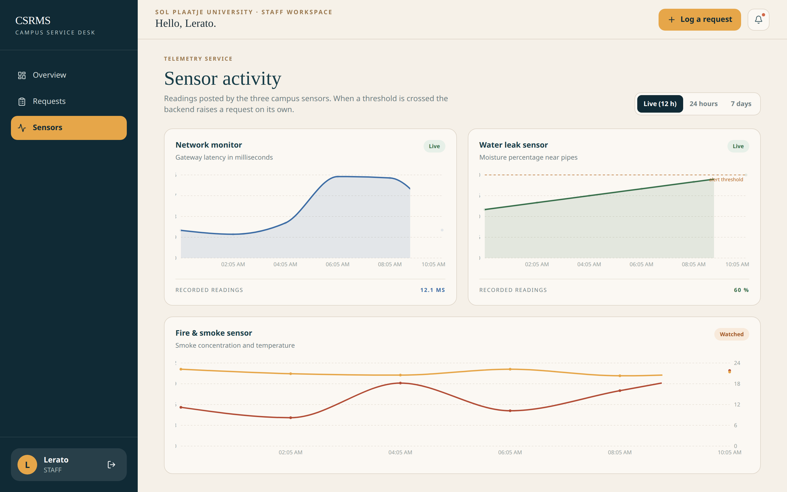

<!-- _class: lead -->

# CSRMS

## Campus Service Request Management System

NADV 744 · Advanced Development Systems · Group Assignment 2026
Sol Plaatje University

Karabelo Nthoroane · 202328762 
Khulani Hlebeya · 202302091 
Kegomoditswe Mongale · 201718863 
Metswi kabo · 202104098

<!-- Good morning/afternoon. We are Group B presenting CSRMS — the Campus Service Request Management System. This project was built for NADV 744, Advanced Development Systems, as a group assignment. Our team of four covered backend, frontend, IoT simulations, testing, and documentation. CSRMS solves a real problem on campus: there is no centralised system for logging and tracking service requests, and some failures like water leaks or overheating go undetected until someone happens to notice. -->

---

# The problem

- Campus maintenance runs on WhatsApp and hallway conversations
- Reports arrive without structure: no category, no location, no owner
- Nobody can answer: _how many problems, how long to fix, which buildings?_
- Some failures **should not depend on a human noticing** — leaks and overheating
  happen at 2am

<!-- The core problem is that campus maintenance currently runs on WhatsApp messages and hallway conversations. Reports arrive without any structure — no category, no location, no assigned owner. Because nothing is written down, nobody can answer basic questions: how many open problems are there, how long does it take to fix them, which buildings have the most issues? Worse, some failures should not depend on a human noticing them. A dripping pipe in a residence or an early sign of smoke in a server room usually only gets reported once someone happens to see it — by which point damage may already be done. CSRMS addresses both sides: a place for students to log requests, and IoT sensors that raise tickets proactively. -->

---

# What we built

One system, two ways in:

- Students log problems → staff resolve them through a managed workflow
- Simulated IoT sensors raise requests **on their own** when conditions demand it

<!-- CSRMS is a layered system with a React frontend talking to a Django REST API. The API is organised into focused services: Auth, User, Request, Assignment, Category, Dashboard, and Telemetry. One shared database underpins everything. On the left you have the human flow — students log in, submit requests, staff assign and resolve them. On the right, three simulated IoT sensors — a network monitor, water leak sensor, and fire/smoke sensor — post readings to the same API. When thresholds are breached, the Telemetry service automatically creates a request in the same table staff already manage. The key architectural decision is that IoT devices are just another API client — not a separate system — so auto-created requests follow the exact same workflow as student reports. -->

---

# How a request travels

Every path — student report or sensor reading — ends in the same audited workflow:
`PENDING → ASSIGNED → IN_PROGRESS → RESOLVED`

<!-- This data flow diagram shows the two paths that feed the same request-handling pipeline. The manual flow starts with a student logging in and receiving a JWT token pair. They submit a request with a category, title, description, priority, and location. The API validates the input and saves the request with status PENDING, logging the creation as the first history entry. Staff then view open requests, filter by status or priority, assign the request to themselves or a colleague — moving it to ASSIGNED — and progress it through IN_PROGRESS to RESOLVED. Every status change is logged with a timestamp and comment. The automatic flow works identically: IoT sensors post readings with a device key, the backend evaluates thresholds, and if triggered, creates a request with source SYSTEM. From that moment it follows the same workflow — staff see it, assign it, resolve it, and it appears in the same history and dashboard views. -->

---

# Security evidence

- Deliberate wrong-password login returns **HTTP 401** and grants no session
- A valid login returns JWT access and refresh tokens
- Students cannot read another student's request, even with a guessed ID
- A user JWT cannot post telemetry; sensors require a type-bound `X-Device-Key`
- Postman provides a visible API fallback for login, telemetry, and deduplication

<!-- Security is a core, examinable concept in this module, and we can prove every claim. First: enter the correct username with a deliberately wrong password — the API returns HTTP 401 and no session is created. A valid login returns a JWT access token and refresh token pair. The access token is required for every subsequent request. Students cannot read another student's request, even if they guess the request ID — the object-level permission returns a 404. A user JWT is worthless for posting telemetry; sensors require a separate per-device key sent via the X-Device-Key header. We will demonstrate all of this live, and the Postman collection provides a visible fallback if anything misbehaves. -->

---

# Security model

| Layer     | Decision                                                                   |
| --------- | -------------------------------------------------------------------------- |
| Auth      | JWT on every endpoint (register/login/refresh excepted)                    |
| Roles     | STUDENT / STAFF / ADMIN — registration always creates STUDENT, server-side |
| Objects   | A student who guesses another's request ID gets a **404**, proven by tests |
| Devices   | Per-sensor keys, SHA-256 hashed, type-bound, individually revocable        |
| Passwords | Django validators + PBKDF2                                                 |

<!-- This table summarises the five security layers. Authentication uses JWT on every endpoint — only register, login, and refresh are public. Role-based access control defines three roles: STUDENT, STAFF, and ADMIN. Public registration always creates a STUDENT account server-side, regardless of what the form submits — you cannot self-elevate to admin. Object-level permissions ensure a student who guesses another student's request ID gets a 404, not the data — this is proven by a named test in the test suite. Device authentication uses per-sensor keys that are SHA-256 hashed at rest, bound to one sensor endpoint each, and individually revocable. Passwords are validated against Django's standard strength rules and hashed with PBKDF2. -->

---

# IoT auto-request rules

| Sensor          | Cadence | Trigger                    | Ticket raised     |
| --------------- | ------- | -------------------------- | ----------------- |
| Network monitor | 5 min   | 3 consecutive failed pings | IT Support · HIGH |
| Water leak      | 2 min   | moisture > 60%             | Facilities · HIGH |
| Fire/smoke      | 10 s    | smoke ≥ 40 or temp ≥ 50 °C | Safety · CRITICAL |

Open SYSTEM tickets are **deduplicated** per sensor+location — a stuck sensor
raises one ticket, not a hundred.

Network, water, and fire/smoke triggers are verified by the backend tests and can be
demonstrated live or through Postman when Wokwi or the network is unavailable.

<!-- The three IoT sensors each have distinct triggers. The network monitor runs every 5 minutes and pings the campus gateway — if it gets 3 consecutive failed pings, it raises an IT Support ticket at HIGH priority. The water leak sensor reports moisture levels every 2 minutes — if moisture exceeds the 60% threshold, a Facilities ticket is raised at HIGH priority. The fire/smoke sensor runs continuously — if smoke concentration reaches 40 or temperature hits 50 degrees Celsius, a Safety ticket is raised at CRITICAL priority. All thresholds are configurable via environment variables. A critical design feature is deduplication: open SYSTEM tickets are deduplicated by sensor and location, so a stuck sensor that keeps tripping raises only one open ticket, not a hundred. A new ticket is created only after the previous one is resolved or cancelled. All three triggers are verified by the automated test suite and can be demonstrated live with Wokwi or through Postman. -->

---

<!-- _class: lead -->

# Live demo

_Student report → staff workflow → sensor-triggered ticket_

<!-- We will now walk through a live demonstration. The demo follows one complete story: a student reports a problem, a staff member picks it up and works through the workflow, and then an IoT sensor detects an issue and raises a ticket automatically. The same workflow applies to both paths. Credentials are: naledi for student, lerato for staff, admin for administrator — all with password Campus hash 2026. -->

---

# Student view

<!-- This is the student dashboard after logging in as naledi. Notice the personal counters at the top — students only ever see their own world. They cannot see other students' requests or any staff-level information. The overview shows their request counts by status. From here they can navigate to Requests to see their full list, log a new request, or check their notifications. Every request shows its current status and a brief history. Let me point out that if a student tries to access another student's request by guessing the ID, they get a 404 — not the data. This is enforced at the object level in our permissions system and proven by a named test. -->

---

# Staff workflow with full history

<!-- This shows the staff view of a request with its full history timeline. Staff see all requests across campus — not just their own. When a staff member opens a request, they see the complete detail: title, description, category, priority, location, and the current status. The history timeline at the bottom shows every state change with a timestamp and comment — who did what and when. Staff can assign the request to themselves or a colleague, moving it to ASSIGNED. They then progress it through IN_PROGRESS to RESOLVED, adding a comment at each step. An important constraint: the workflow enforces valid transitions. You cannot jump from PENDING directly to RESOLVED — the service layer rejects that. This is the same service layer used by the API, the seed command, and the IoT rules, so there is no side door. -->

---

# Live sensor telemetry

<!-- The sensor dashboard shows twelve hours of live telemetry history for all three IoT devices. You can see the network reachability chart, moisture readings from the water leak sensor, and smoke and temperature readings from the fire sensor. Each chart updates in real-time as the sensors post data. During the live demo, we switch to Wokwi and run the water simulation — dragging the potentiometer past 60% triggers an automatic HTTP 201 response. Back in CSRMS, a new SYSTEM ticket appears in the Facilities category at HIGH priority. Posting a second high reading does not create a duplicate — the dedupe key ensures only one open ticket per sensor and location. If time allows, we also demonstrate the fire sensor by pushing the DHT22 temperature slider past 50 degrees, which creates a CRITICAL Safety ticket. The network monitor can be demonstrated through Postman when Wokwi or live network connectivity is limited. -->

---

# Testing & evaluation

- **61 automated API/service tests** — every security claim has a negative test
- Firmware: structural validation + Wokwi scenarios driving sensors to their limits
- Playwright walkthrough of all three roles doubles as the screenshot generator
- Postman collection covers the API as a manual demonstration and fallback
- Performance (50 rounds/endpoint): **p95 under 8 ms** on all reads;
  JWT checks are DB-free, lists are paginated

<!-- Our testing strategy covers four levels. First, 61 automated API and service tests run via Django's APITestCase framework — every security claim we make has a corresponding negative test: wrong password returns 401, student cannot see another student's request, user JWT cannot post telemetry, all three sensor triggers are verified, and deduplication is proven. Second, the IoT firmware has structural validation via a Python script that checks all three Wokwi sketch files, plus automated scenario tests that drive the sensors to their trigger thresholds. Third, a Playwright browser walkthrough exercises all three roles — student, staff, and admin — and the screenshots it captures are what you see in this presentation. Fourth, the Postman collection provides a manual API demonstration and fallback. Performance-wise, we probed every read endpoint with 50 rounds and achieved p95 under 8 milliseconds. JWT token checks are database-free, and all list endpoints are paginated. -->

---

# Limitations & future work

Honest limits: simulated hardware · pull-only notifications · laptop-scale perf data

Next, in order:

1. Email/push notifications with staff digests
2. SLA tracking and automatic escalation
3. Real ESP32 hardware (same sketches, new WiFi credentials)
4. MySQL deployment behind HTTPS

<!-- We want to be honest about the limitations. The IoT sensors run on Wokwi simulated hardware — the same sketches work on real ESP32 boards, but we did not have physical hardware for this submission. Notifications are pull-only: students check their dashboard rather than receiving push alerts. Performance data was collected on laptop scale, not production infrastructure. Looking ahead, the first priority is email and push notifications with staff digests — so staff get alerted when new tickets arrive. Second is SLA tracking with automatic escalation — if a HIGH priority ticket is not picked up within a set time, it escalates. Third is moving to real ESP32 hardware, which requires only changing WiFi credentials and the API URL in the existing sketches. Fourth is a MySQL deployment behind HTTPS for production-grade storage and transport security. -->

---

# One workflow, recorded end to end

<video src="assets/csrms-demo.webm" controls muted style="width: 100%; max-height: 78vh; border-radius: 12px;"></video>

Student report → staff triage → simulated sensor trips → SYSTEM ticket. Same file: `docs/demo/assets/csrms-demo.webm`

<!-- This is a recording of the full end-to-end workflow. It shows a student logging in and reporting a problem, a staff member picking it up and working through the status transitions, and then the IoT sensors tripping and raising SYSTEM tickets automatically. The entire sequence — from student report through staff triage to sensor-triggered tickets — is one continuous workflow recorded in real time. The same video file is available at docs/demo/assets/csrms-demo.webm if you want to review it later. -->

---

<!-- _class: lead -->

# Thank you

github.com/altechemist/NADV74

`README.md` → running everything in three commands

<!-- That concludes our presentation. The full codebase, documentation, test plan, and this slide deck are available on GitHub at github.com/altechemist/NADV74. The README.md in the repository root explains how to run everything in three commands — backend, frontend, and IoT simulations. We are happy to take questions. Thank you. -->
