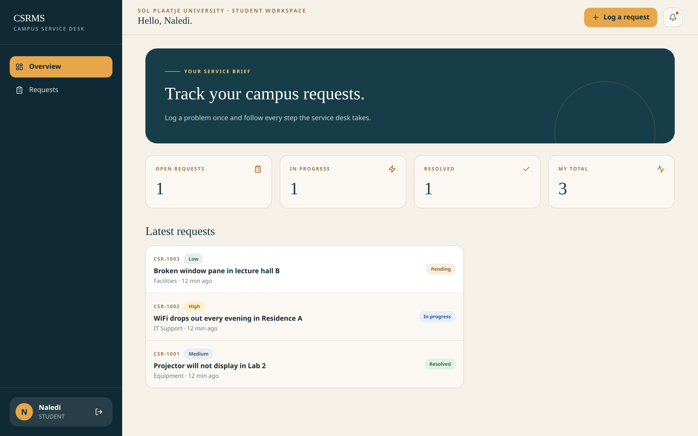

# CSRMS — Campus Service Request Management System

NADV 744 (Advanced Development Systems) Group Assignment 2026 — Sol Plaatje University.

CSRMS gives students one place to log campus problems, gives staff a proper workflow to assign and
resolve them, gives administrators a full view of activity — and uses three simulated IoT sensors
that raise requests on their own when the network goes down, a pipe leaks, or smoke/heat is detected.

### Demo

[](../Demo/CSRMS_Demo.mp4)

Click the image to watch the full walkthrough: student report, staff triage, sensor-triggered tickets.

## Repository layout

| Folder              | Contents                                                                                                                   |
| ------------------- | -------------------------------------------------------------------------------------------------------------------------- |
| `backend/`          | Django REST API: JWT auth, role-based access, request workflow with full history, telemetry ingest with auto-request rules |
| `frontend/`         | React single-page app: login/register, dashboards per role, request tracking, live sensor charts                           |
| `iot/`              | Three Wokwi ESP32 simulations (network monitor, water leak sensor, fire/smoke sensor) with automated scenario tests        |
| `postman/`          | Postman collection covering every endpoint (+ environment template)                                                        |
| `docs/testing/`     | Test plan and performance results                                                                                          |
| `docs/report/`      | Project report (Markdown source plus DOCX/PDF exports)                                                                     |
| `docs/demo/`        | Demo script and slide deck                                                                                                 |
| `docs/diagrams/`    | Architecture, data-flow, ERD, request-lifecycle, and use-case diagrams (Graphviz sources + PNGs)                           |
| `docs/screenshots/` | UI captures generated by the Playwright walkthrough                                                                        |
| `tools/`            | Performance probe, browser walkthrough, report/slide exporters                                                             |

## Quick start

### 1. Backend API

```sh
cd backend
python -m venv ../venv && source ../venv/bin/activate   # Windows: ..\venv\Scripts\activate
pip install -r requirements.txt
cp .env.example .env            # adjust secret key / CORS origins if needed
python manage.py migrate
python manage.py seed_demo      # demo data + device keys (printed once)
python manage.py runserver      # http://127.0.0.1:8000/api/
```

`seed_demo` creates demo accounts (password `Campus#2026`):

| Username | Role    |
| -------- | ------- |
| `admin`  | ADMIN   |
| `lerato` | STAFF   |
| `naledi` | STUDENT |

It also issues one device key per sensor. **The raw keys are printed only once** — copy them into
the Wokwi sketches and/or Postman variables.

### 2. Frontend

```sh
cd frontend
npm install
cp .env.example .env            # VITE_API_BASE_URL points at the API
npm run dev                     # http://localhost:3000
```

### 3. IoT simulations

Each device folder is a Wokwi project that runs in VS Code (recommended — install the
suggested extensions when prompted) or on [wokwi.com](https://wokwi.com). Paste the matching
device key into `DEVICE_KEY`, point `API_URL` at your machine's LAN IP, compile with
`pio run`, and start the simulator. Headless scripts and automated scenario tests live in
`iot/package.json`; details in [`iot/README.md`](iot/README.md).

### 4. Tests

```sh
cd backend && python manage.py test     # 61 automated tests across all services
cd iot && npm run check                 # firmware structural checks (no tooling needed)
node tools/screenshots.mjs              # end-to-end browser walkthrough (needs dev servers)
python3 tools/perf_check.py --n 50      # latency probe against a running API
```

The test plan and captured performance numbers are documented under
[`docs/testing/`](docs/testing/). CI (`.github/workflows/`) runs the Django suite, the
frontend build and the IoT structural checks on every push; full Wokwi simulations run from
`iot.yml` when a `WOKWI_CLI_TOKEN` secret is configured.

## How it fits together

- **Auth:** every endpoint requires a JWT except register/login/refresh. Public registration always
  creates a STUDENT account; staff/admin accounts are issued by an admin.
- **Workflow:** `PENDING → ASSIGNED → IN_PROGRESS → RESOLVED`, every change logged to the request's
  history with timestamp and comment.
- **IoT:** sensors post readings with a per-device key (`X-Device-Key`). The backend applies the
  rules below and raises SYSTEM requests that follow exactly the same workflow as student reports.

| Sensor            | Cadence    | Rule                                   | Auto-created request |
| ----------------- | ---------- | -------------------------------------- | -------------------- |
| Network monitor   | 5 min      | 3 consecutive failed gateway pings     | IT Support · HIGH    |
| Water leak sensor | 2 min      | moisture above threshold (default 60%) | Facilities · HIGH    |
| Fire/smoke sensor | continuous | smoke ≥ 40 or temperature ≥ 50 °C      | Safety · CRITICAL    |

Thresholds are configurable via environment variables — see `backend/.env.example`.

## Documentation

- Report: [`docs/report/CSRMS_Report.pdf`](docs/report/CSRMS_Report.pdf) (DOCX alongside; regenerate from `report.md` with `tools/report_pdf.mjs`)
- Test plan and performance results: [`docs/testing/`](docs/testing/)
- Demo script and slide deck: [`docs/demo/`](docs/demo/) (deck exports via `tools/slides_pdf.mjs`)
- Diagrams: [`docs/diagrams/`](docs/diagrams/)
- API walkthrough: import `postman/CSRMS.postman_collection.json` plus `postman/environment.example.json` into Postman

## License

GPLv2 — see [LICENSE](LICENSE).
